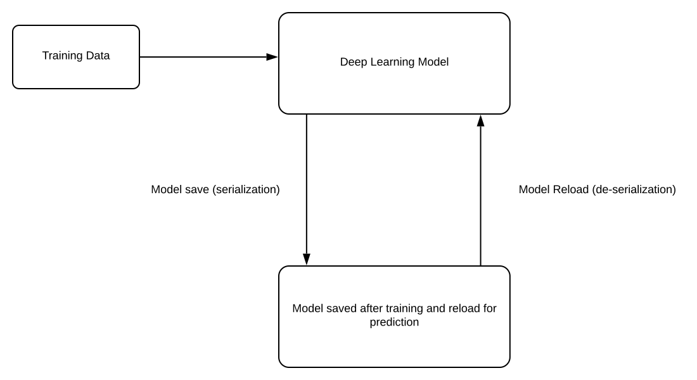

# Photovoltaic Fault Detector


[](CODE_OF_CONDUCT.md)
[](https://www.codetriage.com/rentadronecl/photovoltaic_fault_detector)

[Rentadrone.cl](https://rentadronecl.github.io)

## Forum

This project is part of the [UNICEF Innovation Fund Discourse community](https://unicef-if.discourse.group/c/projects/rentadrone/10). You can post comments or questions about each category of [Rentadrone Developers](https://rentadrone.cl/developers/) algorithms. We encourage users to participate in the forum and to engage with fellow users.

## Summary

Model-definition is a deep learning application for fault detection in photovoltaic plants. In this repository you will find trained detection models that point out where the panel faults are by using radiometric thermal infrared pictures. In [Web-API](https://github.com/RentadroneCL/Web-API) contains a performant, production-ready reference implementation of this repository.



## To do list:

- [x] Import model detection (SSD & YOLO3)
- [x] Example use Trained Model
- [x] Train and Evaluate Model with own data
- [x] Model Panel Detection (SSD7)
- [x] Model Panel Detection (YOLO3)
- [x] Model Soiling Fault Detection (YOLO3)
- [x] Model Diode Fault  Detection (YOLO3)
- [x] Model Other Fault  Detection
- [x] Model Fault Panel Disconnect

## Requirements

* Python 3.x
* Numpy
* TensorFlow 2.x
* Keras 2.x (in TensorFlow)
* OpenCV
* Beautiful Soup 4.x

## Quickstart
In the root project execute the following command to install all dependencies project

```
pip install -r requirements.txt

```
You need install Jupyter notebook to see the code example. You can find the installation documentation for the [Jupyter platform, on ReadTheDocs](https://jupyter.readthedocs.io/en/latest/install.html) or in github page [here](https://github.com/jupyter/notebook).

For a local installation, make sure you have pip installed and run:
```
pip install notebook

```

## Example to use trained model
In ['Example_Prediction'](Code_Example/Example_prediction.ipynb) this is the example of how to implement an already trained model, it can be modified to change the model you have to use and the image in which you want to detect faults.

In ['Example Prediction AllInOne'](Code_Example/Example%20Detection%20AllInOne.ipynb) this is the example of how implement all trained model, you can use this code for predict a folder of images and have a output image with detection boxes.

In ['Example_Prediction_Orthophoto'](Code_Example/Example_prediction_Ortofoto.ipynb) this is the example of how implement all trained model, you can use this code for predict a Orthophot and have a output image with detection boxes.


## Developers
Help improve our software! We welcome contributions from everyone, whether to add new features, improve speed, fix existing bugs or add support. [Check our code of conduct](CODE_OF_CONDUCT.md), [the contributing guidelines](CONTRIBUTING.md) and how decisions are made.

Any code contributions are welcomed as long as they are discussed in [Github Issues](https://github.com/RentadroneCL/model-definition/issues) with maintainers. Be aware that if you decide to change something and submit a PR on your own, it may not be accepted.

#### Creating an issue
You can open a new issue based on code from an existing pull request. For more information, see [the template for filling issues](https://github.com/RentadroneCL/model-definition/blob/master/.github/ISSUE_TEMPLATE/feature_request.md)


# Model Detection
The models used for detection are SSD [SSD: Single Shot MultiBox Detector](https://arxiv.org/abs/1512.02325) and YOLOv3 [YOLOv3: An Incremental Improvement] (https://arxiv.org/abs/1804.02767), they are imported from the following repositories:
* [SSD_Keras](https://github.com/pierluigiferrari/ssd_keras#how-to-fine-tune-one-of-the-trained-models-on-your-own-dataset)
* [YOLOv3_Keras](https://github.com/experiencor/keras-yolo3)

Grab the pretrained weights of SSD and  YOLO3 from [Drive_Weights](https://drive.google.com/drive/folders/1LSc9FkAwJrAAT8pAUWz8aax_biFAMMXS?usp=sharing)

|    Model    |  Pretrained Weights |
|:-----------:|:-------------------:|
| SSD7/SSD300 |    [Weight VGG16](https://drive.google.com/open?id=1VHTx28tGI94yFqwT_WHp-xkx_8Hh_A31)|
|    YOLO3    | [Weight Full Yolo3](https://drive.google.com/open?id=1cnCQHl-TnOrwb-leug1I0O9vMBaSwJLt)|


## Type of Data
The images used for the design of this model were extracted by air analysis, specifically: FLIR aerial radiometric thermal infrared pictures, taken by UAV (R-JPEG format). Which were converted into .jpg images for the training of these detection models.
Example FLIR image:


Same image in .jpg format:


## Training

### 1. Data preparation

View folder Train&Test_A/ and Train&Test_S/, example of panel anns and soiling fault anns.

Organize the dataset into 4 folders:

+ train_image_folder <= the folder that contains the train images.

+ train_annot_folder <= the folder that contains the train annotations in VOC format.

+ valid_image_folder <= the folder that contains the validation images.

+ valid_annot_folder <= the folder that contains the validation annotations in VOC format.

There is a one-to-one correspondence by file name between images and annotations.
For create own data set use LabelImg code from :
[https://github.com/tzutalin/labelImg](https://github.com/tzutalin/labelImg)

### 2. Edit the configuration file
The configuration file for YOLO3 is a json file, which looks like this  (example soiling fault ):

```python
{
    "model" : {
        "min_input_size":       400,
        "max_input_size":       400,
        "anchors":              [5,7, 10,14, 15, 15, 26,32, 45,119, 54,18, 94,59, 109,183, 200,21],
        "labels":               ["1"],
	"backend": 		"full_yolo_backend.h5"
    },

    "train": {
        "train_image_folder":   "../Train&Test_S/Train/images/",
        "train_annot_folder":   "../Train&Test_S/Train/anns/",
	"cache_name":           "../Experimento_fault_1/Resultados_yolo3/full_yolo/experimento_fault_1_gpu.pkl",

        "train_times":          1,

        "batch_size":           2,
        "learning_rate":        1e-4,
        "nb_epochs":            200,
        "warmup_epochs":        15,
        "ignore_thresh":        0.5,
        "gpus":                 "0,1",

	"grid_scales":          [1,1,1],
        "obj_scale":            5,
        "noobj_scale":          1,
        "xywh_scale":           1,
        "class_scale":          1,

	"tensorboard_dir":      "log_experimento_fault_gpu",
	"saved_weights_name":   "../Experimento_fault_1/Resultados_yolo3/full_yolo/experimento_yolo3_full_fault.h5",
        "debug":                true
    },

    "valid": {
        "valid_image_folder":   "../Train&Test_S/Test/images/",
        "valid_annot_folder":   "../Train&Test_S/Test/anns/",
        "cache_name":           "../Experimento_fault_1/Resultados_yolo3/full_yolo/val_fault_1.pkl",

        "valid_times":          1
    },
   "test": {
        "test_image_folder":   "../Train&Test_S/Test/images/",
        "test_annot_folder":   "../Train&Test_S/Test/anns/",
        "cache_name":          "../Experimento_fault_1/Resultados_yolo3/full_yolo/test_fault_1.pkl",

        "test_times":          1
    }
}
```
The configuration file for SSD300 is a json file, which looks like this  (example soiling fault ) and .txt with name of images (train.txt):
```
{
    "model" : {
        "backend":      "ssd300",
        "input":        400,
        "labels":               ["1"]
    },

    "train": {
        "train_image_folder":   "Train&Test_S/Train/images",
        "train_annot_folder":   "Train&Test_S/Train/anns",
        "train_image_set_filename": "Train&Test_S/Train/train.txt",

        "train_times":          1,
        "batch_size":           12,
        "learning_rate":        1e-4,
        "warmup_epochs":        3,
        "nb_epochs":            100,
	       "saved_weights_name":     "Result_ssd300_fault_1/experimento_ssd300_fault_1.h5",
        "debug":                true
    },
    "valid": {
            "valid_image_folder":   "../Train&Test_D/Test/images/",
            "valid_annot_folder":   "../Train&Test_D/Test/anns/",
            "valid_image_set_filename":   "../Train&Test_D/Test/test.txt"
        },

"test": {
        "test_image_folder":   "Train&Test_S/Test/images",
        "test_annot_folder":   "Train&Test_S/Test/anns",
        "test_image_set_filename":   "Train&Test_S/Test/test.txt"
    }
}
```

### 3. Start the training process

`python train_ssd.py -c config.json -o /path/to/result`

or
`python train_ssd.py -c config.json -o /path/to/result`

By the end of this process, the code will write the weights of the best model to file best_weights.h5 (or whatever name specified in the setting "saved_weights_name" in the config.json file). The training process stops when the loss on the validation set is not improved in 20 consecutive epoches.

### 4. Perform detection using trained weights on image, set of images

`python predict_ssd.py -c config.json -i /path/to/image/or/video -o /path/output/result`
or
`python predict_yolo.py -c config.json -i /path/to/image/or/video -o /path/output/result`

It carries out detection on the image and write the image with detected bounding boxes to the same folder.

## Evaluation
The evaluation is integrated into the training process, if you want to do the independent evaluation you must go to the folder ssd_keras-master or keras-yolo3-master and use the following code

`python evaluate.py -c config.json`

Compute the mAP performance of the model defined in `saved_weights_name` on the validation dataset defined in `valid_image_folder` and `valid_annot_folder`.

# Weights of Trained Models
All of weights of this trained model grab from [Drive_Weights](https://drive.google.com/drive/folders/1LSc9FkAwJrAAT8pAUWz8aax_biFAMMXS?usp=sharing)

|      Model     |  Weights Trained |  Config  |
|:--------------:|:------------------:|:--------:|
|   SSD7 Panel   |      [weight](https://drive.google.com/open?id=1qNjfAp9sW1VJh8ewnb3NKuafhZockTqV)      | [config](Result_ssd7_panel/config_7_panel.json) |
| SSD300 Soiling |      [weight](https://drive.google.com/open?id=1IiOyYW8yPAh4IALbM_ZVqRhLdxV-ZSPw)      | [config](config_300_fault_1.json) |
|   YOLO3 Panel  |      [weight](https://drive.google.com/open?id=14zgtgDJv3KTvhRC-VOz6sqsGPC_bdrL1)      | [config](config_full_yolo_panel_infer.json) |
|  YOLO3 Soiling |      [weight](https://drive.google.com/open?id=1YLgkn1wL5xAGOpwd2gzdfsJVGYPzszn-)      | [config](config_full_yolo_fault_1_infer.json) |
|   YOLO3 Diode  |      [weight](https://drive.google.com/open?id=1VUtrK9JVTbzBw5dX7_dgLTMToFHbAJl1)      | [config](config_full_yolo_fault_4_infer.json) |
|   YOLO3 Affected Cell    |      [weight](https://drive.google.com/open?id=1ngyCzw7xF0N5oZnF29EIS5LOl1PFkRRM)      | [config](config_full_yolo_fault_2_infer.json) |

The image used are specified in [Table images](Training_Images.xlsx).
You can see some examples in [Summary of results](README_Result.md).

# Contributing

Contributions are welcome and will be fully credited. We accept contributions via Pull Requests on GitHub.

## Pull Request Checklist

Before sending your pull requests, make sure you followed this list.

- Read [contributing guidelines](CONTRIBUTING.md).
- Read [Code of Conduct](CODE_OF_CONDUCT.md).
- Check if my changes are consistent with the [guidelines](https://github.com/RentadroneCL/model-definition/blob/master/CONTRIBUTING.md#general-guidelines-and-philosophy-for-contribution).
- Changes are consistent with the [Coding Style](https://github.com/RentadroneCL/model-definition/blob/master/CONTRIBUTING.md#c-coding-style).
- Run [Unit Tests](https://github.com/RentadroneCL/model-definition/CONTRIBUTING.md#running-unit-tests).


