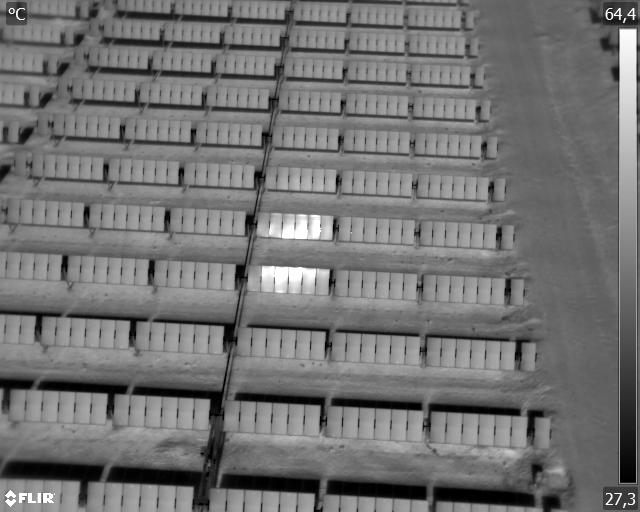
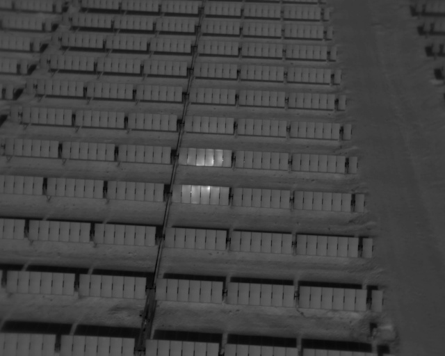
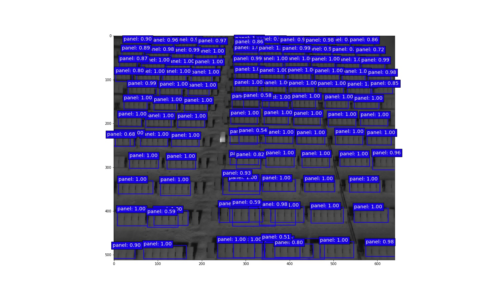
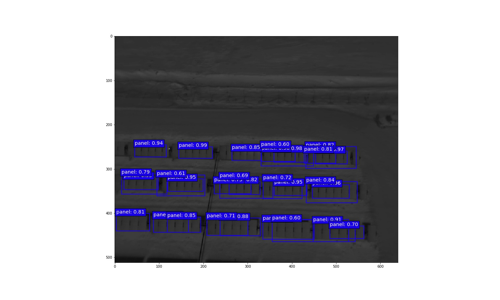
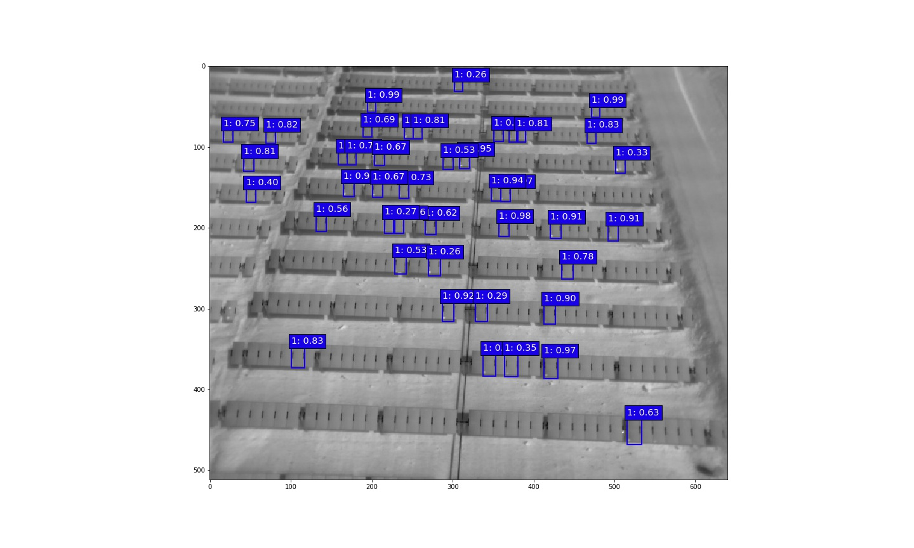
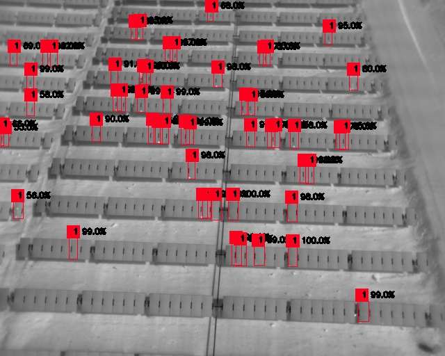

# Rentadrone_MachineLearning  Photovoltaic fault detector 


## To do list:
- [x] Import model detection (SSD & YOLO3)
- [x] Model Panel Detection
- [x] Model Soiling Fault Detection
- [x] Model Diode Fault  Detection
- [ ] Model Other Fault  Detection
- [x] Example use Trained Model


## Dependencies

* Python 3.x
* Numpy
* TensorFlow 1.x
* Keras 2.x
* OpenCV
* Beautiful Soup 4.x

## Model Detection
The models used for detection are SSD [SSD: Single Shot MultiBox Detector](https://arxiv.org/abs/1512.02325) and YOLOv3 [YOLOv3: An Incremental Improvement] (https://arxiv.org/abs/1804.02767), they are imported from the following repositories:
* [SSD_Keras](https://github.com/pierluigiferrari/ssd_keras#how-to-fine-tune-one-of-the-trained-models-on-your-own-dataset)
* [YOLOv3_Keras](https://github.com/experiencor/keras-yolo3)

Grab the pretrained weights of SSD and  YOLO3 from [Drive_Weights](https://drive.google.com/drive/folders/1LSc9FkAwJrAAT8pAUWz8aax_biFAMMXS?usp=sharing)

## Type of Data
The images used for the design of this model were extracted by air analysis, specifically: FLIR aerial radiometric thermal infrared pictures, taken by UAV (R-JPEG format). Which were converted into .jpg images for the training of these detection models.
Example FLIR image:



Same image in .jpg format:



## Training

### 1. Data preparation 

View folder Train&Test_A/ and Train&Test_S/, example of panel anns and soiling fault anns.

Organize the dataset into 4 folders:

+ train_image_folder <= the folder that contains the train images.

+ train_annot_folder <= the folder that contains the train annotations in VOC format.

+ valid_image_folder <= the folder that contains the validation images.

+ valid_annot_folder <= the folder that contains the validation annotations in VOC format.
    
There is a one-to-one correspondence by file name between images and annotations. 
For create own data set use LabelImg code from :
[https://github.com/tzutalin/labelImg](https://github.com/tzutalin/labelImg)

### 2. Edit the configuration file
The configuration file for YOLO3 is a json file, which looks like this  (example soiling fault ):

```python
{
    "model" : {
        "min_input_size":       400,
        "max_input_size":       400,
        "anchors":              [5,7, 10,14, 15, 15, 26,32, 45,119, 54,18, 94,59, 109,183, 200,21],
        "labels":               ["1"],
	"backend": 		"full_yolo_backend.h5"
    },

    "train": {
        "train_image_folder":   "../Train&Test_S/Train/images/",
        "train_annot_folder":   "../Train&Test_S/Train/anns/",
	"cache_name":           "../Experimento_fault_1/Resultados_yolo3/full_yolo/experimento_fault_1_gpu.pkl",

        "train_times":          1,

        "batch_size":           2,
        "learning_rate":        1e-4,
        "nb_epochs":            200,
        "warmup_epochs":        15,
        "ignore_thresh":        0.5,
        "gpus":                 "0,1",

	"grid_scales":          [1,1,1],
        "obj_scale":            5,
        "noobj_scale":          1,
        "xywh_scale":           1,
        "class_scale":          1,

	"tensorboard_dir":      "log_experimento_fault_gpu",
	"saved_weights_name":   "../Experimento_fault_1/Resultados_yolo3/full_yolo/experimento_yolo3_full_fault.h5",
        "debug":                true
    },

    "valid": {
        "valid_image_folder":   "../Train&Test_S/Test/images/",
        "valid_annot_folder":   "../Train&Test_S/Test/anns/",
        "cache_name":           "../Experimento_fault_1/Resultados_yolo3/full_yolo/val_fault_1.pkl",

        "valid_times":          1
    },
   "test": {
        "test_image_folder":   "../Train&Test_S/Test/images/",
        "test_annot_folder":   "../Train&Test_S/Test/anns/",
        "cache_name":          "../Experimento_fault_1/Resultados_yolo3/full_yolo/test_fault_1.pkl",

        "test_times":          1
    }
}
```
The configuration file for SSD300 is a json file, which looks like this  (example soiling fault ) and .txt with name of images (train.txt):
```
{
    "model" : {
        "backend":      "ssd300",
        "input":        400,
        "labels":               ["1"]
    },

    "train": {
        "train_image_folder":   "Train&Test_S/Train/images",
        "train_annot_folder":   "Train&Test_S/Train/anns",
        "train_image_set_filename": "Train&Test_S/Train/train.txt",

        "train_times":          1,
        "batch_size":           12,
        "learning_rate":        1e-4,
        "warmup_epochs":        3,
        "nb_epochs":            100,
	       "saved_weights_name":     "Result_ssd300_fault_1/experimento_ssd300_fault_1.h5",
        "debug":                true
    },
    "valid": {
            "valid_image_folder":   "../Train&Test_D/Test/images/",
            "valid_annot_folder":   "../Train&Test_D/Test/anns/",
            "valid_image_set_filename":   "../Train&Test_D/Test/test.txt"
        },

"test": {
        "test_image_folder":   "Train&Test_S/Test/images",
        "test_annot_folder":   "Train&Test_S/Test/anns",
        "test_image_set_filename":   "Train&Test_S/Test/test.txt"
    }
}
```

### 3. Start the training process

`python train_ssd.py -c config.json -o /path/to/result`

or
`python train_ssd.py -c config.json -o /path/to/result`

By the end of this process, the code will write the weights of the best model to file best_weights.h5 (or whatever name specified in the setting "saved_weights_name" in the config.json file). The training process stops when the loss on the validation set is not improved in 20 consecutive epoches.

### 4. Perform detection using trained weights on image, set of images

`python predict_ssd.py -c config.json -i /path/to/image/or/video -o /path/output/result`
or
`python predict_yolo.py -c config.json -i /path/to/image/or/video -o /path/output/result`

It carries out detection on the image and write the image with detected bounding boxes to the same folder.

## Evaluation
The evaluation is integrated into the training process, if you want to do the independent evaluation you must go to the folder ssd_keras-master or keras-yolo3-master and use the following code

`python evaluate.py -c config.json`

Compute the mAP performance of the model defined in `saved_weights_name` on the validation dataset defined in `valid_image_folder` and `valid_annot_folder`.

# Result
All of weights of this trained model grab from [Drive_Weights](https://drive.google.com/drive/folders/1LSc9FkAwJrAAT8pAUWz8aax_biFAMMXS?usp=sharing)
## Panel Detector
### SDD7
On folder [Result ssd7 panel](Result_ssd7_panel/) show code (jupyter notebook), weight and result of this model (mAP 89.8%).





## Soiling Fault Detector
### SSD300
On folder [Result ssd300 fault 1](Result_ssd300_fault_1/) show code (jupyter notebook), weight and result of this model (mAP 79.5%).





### YOLO3
On folder [Result yolo3 fault 1](Result_yolo3_fault_1/) show [history train](Result_yolo3_fault_1/yolo3_full_yolo.output), weight and result of this model (mAP 73.02%).





## Diode Fault Detector
### YOLO3
On folder [Result yolo3 fault 4](Result_yolo3_fault_4/) show [history train](Result_yolo3_fault_4/yolo3_full_yolo.output), weight and result of this model (mAP 73.02%).


# Contributing

Contributions are welcome and will be fully credited. We accept contributions via Pull Requests on GitHub.

## Pull Request Checklist

Before sending your pull requests, make sure you followed this list.

- Read [contributing guidelines](CONTRIBUTING.md).
- Read [Code of Conduct](CODE_OF_CONDUCT.md).
- Check if my changes are consistent with the [guidelines](https://github.com/RentadroneCL/model-definition/blob/master/CONTRIBUTING.md#general-guidelines-and-philosophy-for-contribution).
- Changes are consistent with the [Coding Style](https://github.com/RentadroneCL/model-definition/blob/master/CONTRIBUTING.md#c-coding-style).
- Run [Unit Tests](https://github.com/RentadroneCL/model-definition/CONTRIBUTING.md#running-unit-tests).


# Example to use trained model

In ['Example_Prediction'](Example_prediction.ipynb) this is the example of how to implement an already trained model, it can be modified to change the model you have to use and the image in which you want to detect faults.
