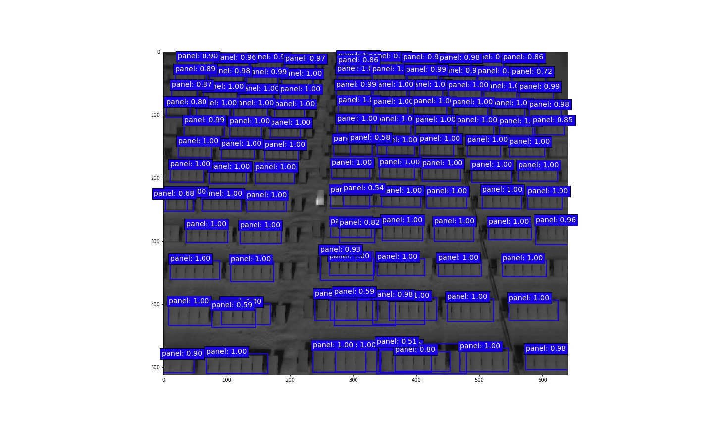
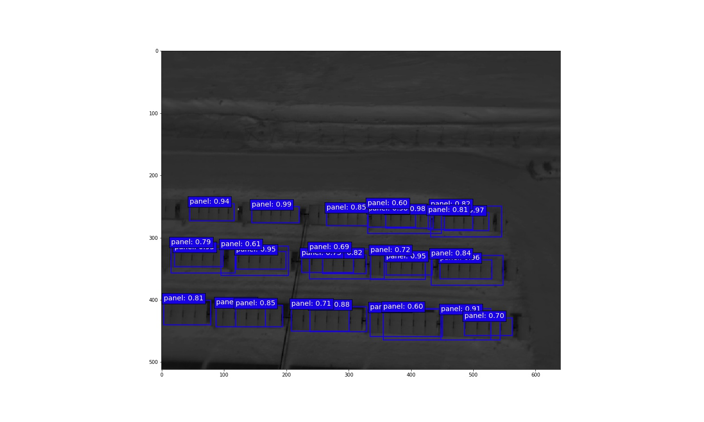
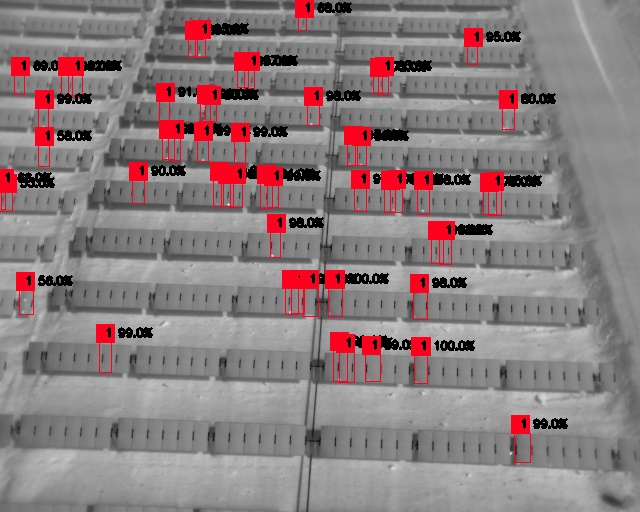

# Result Photovoltaic fault detector

## Panel Detector
### SDD7
On folder [Result ssd7 panel](Result_ssd7_panel/) show code (jupyter notebook), weight and result of this model (mAP 89.8%).

  

  

### YOLO3
On folder [Result yolo3 panel](Result_yolo3_panel/)  weight and result of this model (mAP 86.3%).

  

## Soiling Fault Detector
### SSD300
On folder [Result ssd300 fault 1](Result_ssd300_fault_1/) show code (jupyter notebook), weight and result of this model (mAP 79.5%).

  

### YOLO3
On folder [Result yolo3 fault 1](Result_yolo3_fault_1/) show [history train](Result_yolo3_fault_1/yolo3_full_yolo.output), weight and result of this model (mAP 73.02%).

  

## Affected Cell Detector
### YOLO3
On folder [Result yolo3 fault 2](Result_yolo3_fault_2/) show [history train](Result_yolo3_fault_2/yolo3_full_yolo.output), weight and result of this model (mAP 71.93%).

  

## Diode Fault Detector
### YOLO3
On folder [Result yolo3 fault 4](Result_yolo3_fault_4/) show [history train](Result_yolo3_fault_4/yolo3_full_yolo.output), weight and result of this model (mAP 66.22%).

  

## Panel Disconnect Detector
### YOLO3
To use the detector we must only use 'panel_yolo3_disconnect.py' with the previously established form, that is:
`python predict_yolo3_disconnect.py -c config_full_yolo_panel_infer.json -i /path/to/image/ -o /path/output/result`
To use this model, only the yolo3_panel detector model is needed.

  

The idea to detect the disconnection is by calculating the luminosity of each panel, to then normalize this data and highlight the panels with a luminosity out of normality.
